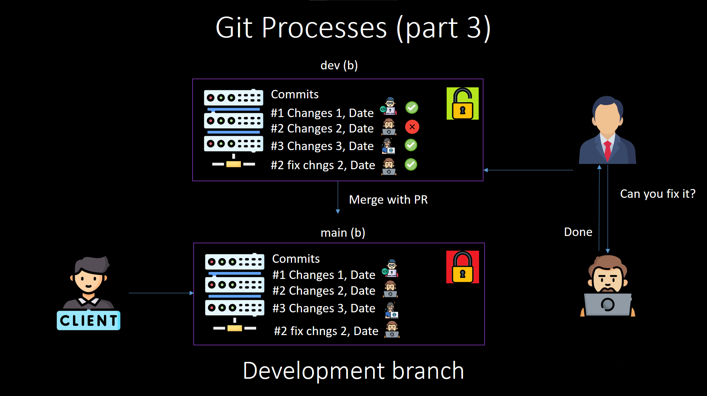

# Инструкция по работе с Git


LICENSE[MIT](./license.md)


Это репозиторий, содержащий подробную инструкцию по использованию системы контроля версий Git. В данной документации описаны основные команды и концепции, которые помогут новичкам освоить Git, а также более продвинутые функции для опытных пользователей.

## Содержание

1. [Введение](docs/introduction.md)
   - Знакомство с Git, его преимуществами и основными понятиями.
   
2. [Основные команды Git](docs/basic-commands.md)
   - Описание самых часто используемых команд для работы с репозиториями.

3. [Ветвление в Git](docs/branching.md)
   - Как работать с ветками в Git, создание, слияние и удаление веток.

4. [Слияние веток](docs/merging.md)
   - Все, что нужно знать о слиянии веток и разрешении конфликтов.

5. [Расширенные возможности](docs/advanced-features.md)
   - Введение в более сложные функции, такие как подмодули и работа с удалёнными репозиториями.

6. [.gitignore](docs/gitignore.md)
   - Как использовать файл `.gitignore` для исключения файлов и директорий из контроля версий.

## Установка

Для того чтобы начать использовать Git, вам нужно установить его на вашей машине. Следуйте инструкции по установке на официальном сайте Git:

- [Скачать Git](https://git-scm.com/downloads)

## Как использовать эту инструкцию

1. Клонируйте репозиторий:
   ```bash
   git clone https://github.com/qMush/git-guide.git


